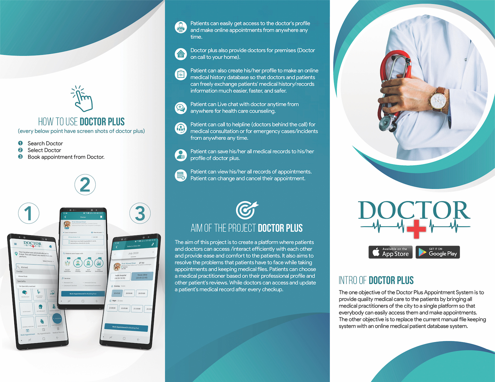

# Doctor Plus - Web Application

Doctor Plus is a comprehensive web application designed to serve as the backbone of the Doctor Plus ecosystem, a pioneering healthcare platform affiliated with the Ministry of Health in Afghanistan. This project includes both the frontend and backend components, providing a robust interface for various users, including patients, doctors, admins, and super admins.

## Overview

The Doctor Plus web application is a crucial part of a broader ecosystem that includes mobile apps and microservices. While the mobile apps are focused on patient and doctor interactions, this web platform offers extended functionality, especially for administrative tasks. Ministry officials, admins, and super admins use this platform to manage data, approve doctor profiles, and oversee healthcare services across the country.

## Features

### Admin & Super Admin Functionality

- **Doctor Approval Process:** Admins and super admins have the authority to review and approve doctor profiles before they are made publicly available.
- **Data Management:** Comprehensive tools for managing and overseeing the vast amount of data generated within the Doctor Plus ecosystem.
- **User Management:** Admins can manage both patient and doctor accounts, including the ability to reset passwords, deactivate accounts, and manage roles.
- **Reporting & Analytics:** Generate detailed reports and analytics on various aspects of healthcare services, providing valuable insights for decision-making.
- **System Monitoring:** Tools to monitor system performance, user activity, and potential issues across the platform.

### General Functionality

- **Doctor Search & Recommendations:** Search for doctors based on name, specialty, and location, with system-generated recommendations based on patient reviews.
- **Appointment Management:** View and manage appointments for multiple patients, including booking, rescheduling, and cancellations.
- **Medical History & Patient Profiles:** Access detailed patient histories, including past visits, diagnoses, prescriptions, and doctor interactions.
- **Chat Functionality:** Engage in doctor-patient communication through a secure chat system, supporting text, file, and voice message exchanges.

## Tools & Technologies

The Doctor Plus web application is built using the following technologies:

- **Python**: The primary programming language for backend development.
- **Django Framework**: Used to build a robust and scalable backend.
- **Django REST Framework (DRF)**: Provides a flexible and powerful toolkit for building Web APIs.
- **JavaScript (JQuery)**: Enhances interactivity and user experience on the frontend.
- **CSS & Bootstrap**: Used for designing a responsive and user-friendly interface.

## Doctor Plus Ecosystem - Related Projects

Doctor Plus is part of a broader initiative that includes several related services:

- **[Doctor Plus Mobile App](https://github.com/arifhaidari/doctor_plus)**: The mobile app for patients to find doctors, book appointments, and manage their medical profiles.
- **[Doctor Practice Mobile App](https://github.com/arifhaidari/doctor_practice)**: The mobile app for doctors to manage appointments, patient records, and their professional profiles.
- **[Legacy Version of Doctor Plus](https://github.com/arifhaidari/legacy_doctor_plus)**: The earlier version of the Doctor Plus mobile application.
- **[Legacy Version of Doctor Practice](https://github.com/arifhaidari/legacy_doctor_practice)**: The earlier version of the Doctor Practice mobile application.
- **[Doctor Registration, License, and Clinic](#)**
- **[News & More](#)**

Explore these platforms to learn more about how Doctor Plus is transforming healthcare in Afghanistan.

## License

This project is licensed under the terms of the **Copyright © 2021 Arif Haidari and FSH**.

This project was originally private and has been made public for educational and portfolio purposes only. The code, design, or any other materials may not be used, copied, modified, merged, published, distributed, sublicensed, or sold for production or commercial purposes without explicit permission from the copyright holder.

Please respect the intellectual property rights and refrain from using this project for any production or commercial use.

## Contact

For any inquiries, please contact:

**Arif Haidari**  
Email: [arifhaidari336@gmail.com](mailto:arifhaidari336@gmail.com)
